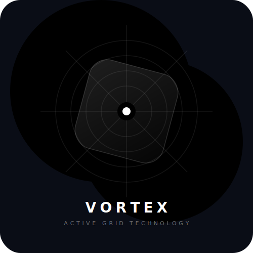
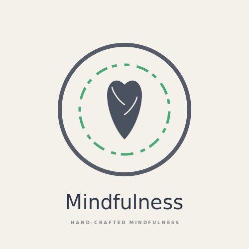
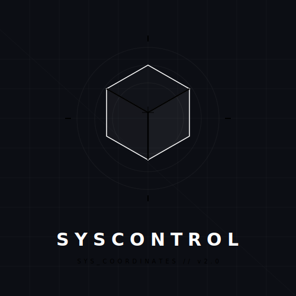
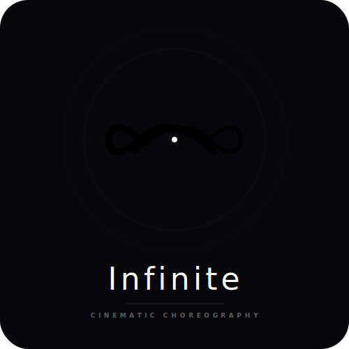
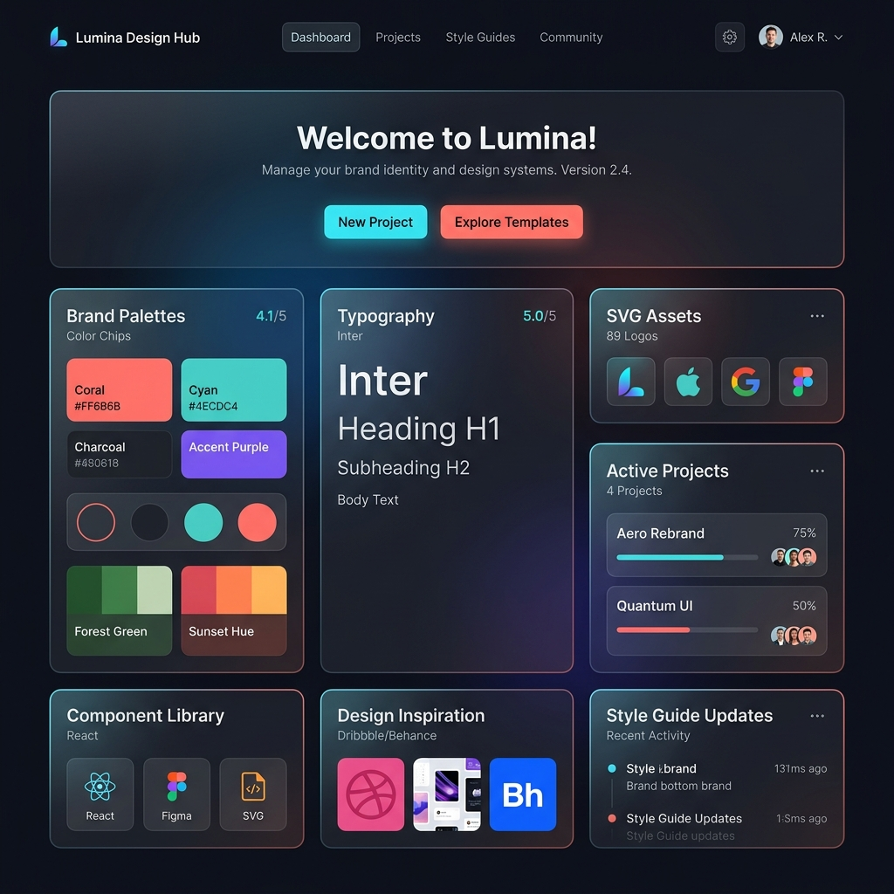
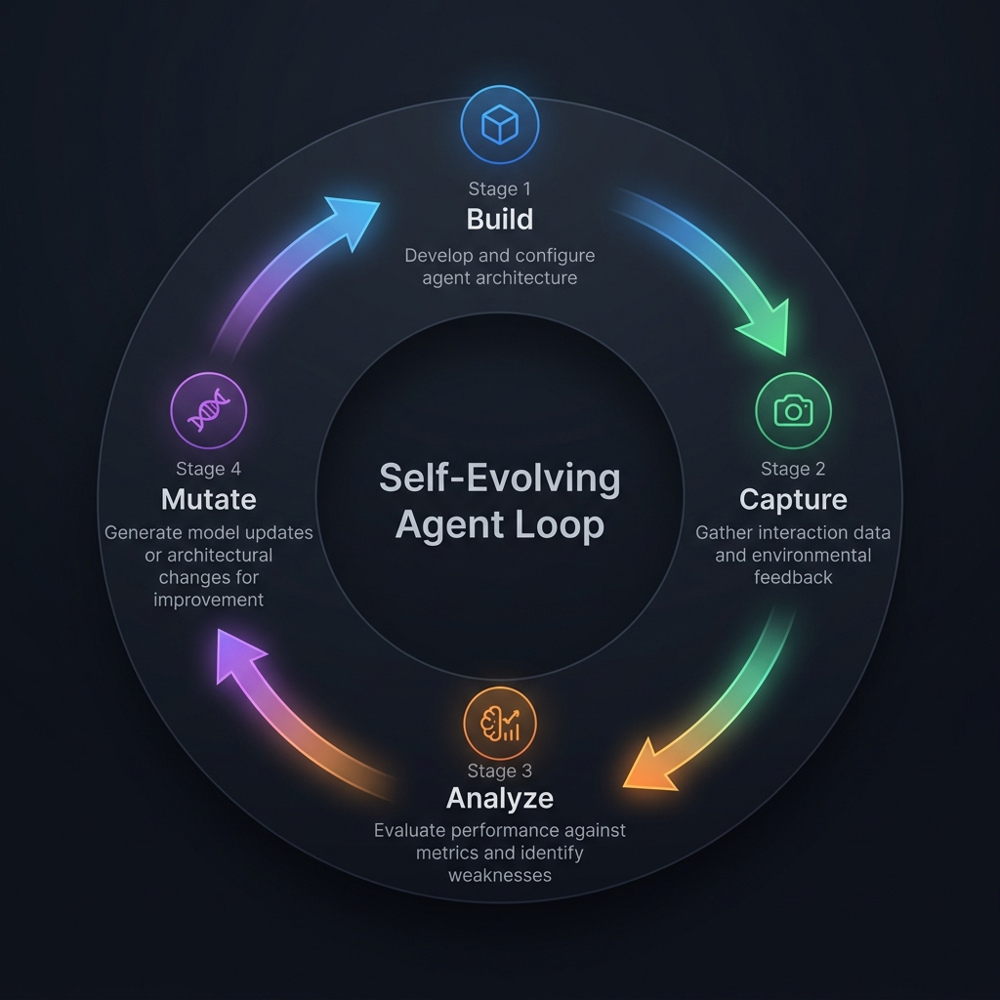
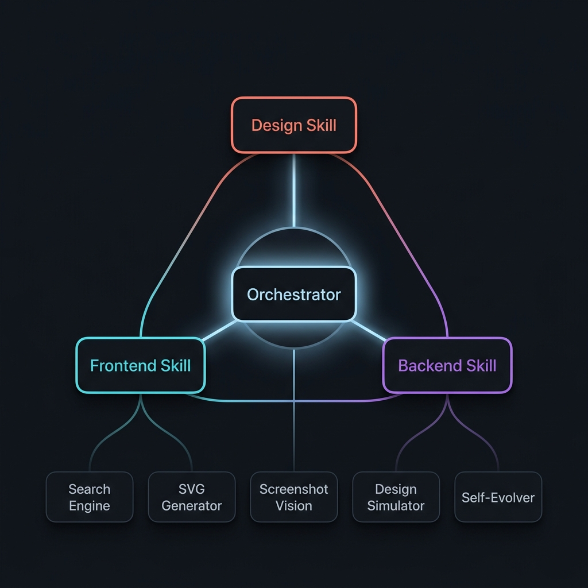

<h1 align="center">
  <br>
  🎬 Avant-Garde Director Skill
  <br>
</h1>

<p align="center">
  <strong>The AI skill system that transforms coding agents into disciplined UI/UX engineers.</strong>
  <br>
  <em>Every pixel has purpose. Every interaction has logic. Every movement has choreography.</em>
</p>

<p align="center">
  <a href="https://github.com/aggu000000-lgtm/UI-UX-skill/blob/main/LICENSE"></a>
  <a href="https://github.com/vercel-labs/skills"></a>
  
  
  
</p>

<p align="center">
  
  
  
  
  
</p>

---

## 🧬 What Makes This Different

Most AI skill files are static instruction sheets. This is a **living cognitive system** — giving AI agents the ability to *see*, *reason about*, and *self-correct* their designs.

| Capability | What It Does |
|-----------------------------|-------------------------------------------------------------------------------------------------------------------|
| **🧠 Design Cognition**     | Agents understand *why* designs work using Gestalt laws, Hick's Law cognitive budgets, and APCA contrast calculus |
| **👁️ Terminal Vision**      | Non-multimodal agents "see" output via truecolor ANSI rendering and ASCII luminance maps                        |
| **🔄 Self-Evolving Loop**   | Autonomous build → screenshot → analyze → mutate cycle until design passes audit                                  |
| **🎯 SVG Precision Engine** | Mathematical vector logo generation in 4 styles — no external APIs needed                                         |
| **🔍 Built-in Search**      | CLI search across 1000 design elements, 1000 fonts, and royalty-free images — saving thousands of tokens          |
| **🛡️ Anti-AI-Slop**         | 1000 documented banned patterns from 2025-2026. No generic gradients, card soup, or Inter/Roboto                 |

---

## 🖼️ Demo Showcase

### SVG Logo Generation Engine — Real Output

Generated with `node skills/utils/svg-generator.js`. These are **real SVGs** from the engine:

<table>
<tr>
<td align="center" width="50%">
<br>
<strong>Bento</strong> — Geometric grid, OKLCH gradients, glassmorphic shield
</td>
<td align="center" width="50%">
<br>
<strong>Organic</strong> — Paper grain, wobble displacement, botanical leaf
</td>
</tr>
<tr>
<td align="center" width="50%">
<br>
<strong>Brutalist</strong> — Blueprint grid, isometric wireframe, radar rings
</td>
<td align="center" width="50%">
<br>
<strong>Cinematic</strong> — Portal loop curves, gaussian glow, serif italic
</td>
</tr>
</table>

> One command: `node skills/utils/svg-generator.js --type bento --name "Brand" --output logo.svg`

### Cognitive Design Simulator — Real Output

The simulator audits any HTML file and outputs spatial analysis:

```
🧠 COGNITIVE DESIGN SIMULATOR & AUDITOR
📁 File: "index.html"

--- VISUAL DENSITY BALANCE CANVAS ---

  = = = = = = = = = = = = = = = = = = = = = = =
  = = = = = = = = = = = = = = = = = = = = = = =
  @ @ @ @ @ @ @ @ @ @ @ @ @ @ @ @ @ @ @ @ @ @ @
  * * * * * * *   : : : : : : :
  * * * * * * *   : : : : : : :
  * * * * * * *   : : : : : : :

--- COGNITIVE METRICS REPORT ---
- Visual Weight Centroid: (0.342, 0.323) | Total Weight Mass: 6207
- Cognitive Load Index: 82 | Rating: Visual Overload (Friction High)
  [Elements Count: 10 | Interactive Count: 2 | Colors: 39]
- Layout Balance Advice: Warning: Too many colors or interactive targets.

--- STRUCTURAL DESIGN CRITIQUE ---
- Visual Weight Centroid is skewed significantly LEFT.
- Typographic Rhythm warning: No max-width: 65ch paragraph boundary detected.
```

> Run it: `node skills/utils/design-simulator.js --file ./index.html`

### Font Search Engine — Real Output

```
$ node skills/utils/search.js --fonts "elegant" --classification "Serif"

| NAME               | CLASSIFICATION | USE_CASE              | MOOD                            | PAIRING         |
| ------------------ | -------------- | --------------------- | ------------------------------- | --------------- |
| Instrument Serif   | Serif          | Editorial headlines   | Elegant authority               | Instrument Sans |
| DM Serif Display   | Serif          | Display serif headers | Elegant display serif           | DM Sans         |
| Cormorant Garamond | Serif          | Elegant Garamond body | Elegant Garamond sophistication | Work Sans       |
| Arapey             | Serif          | Elegant serif body    | Elegant serif warmth            | Open Sans       |
```

> Searches 1000 underrated fonts without burning tokens parsing CSV files.

### Bento Grid Visual Explorer

<p align="center">
  
</p>

> Launch with `node skills/explorer/server.js` and open `http://localhost:3000`. Features glassmorphic Bento cards, live Google Fonts previewing, masonry image grid, and dark/light mode toggle.

### Self-Evolving Agent Loop

<p align="center">
  
</p>

> Agents build → screenshot → analyze → mutate in an autonomous reflection cycle. The self-evolver generates `evolution-prompt.md` with specific CSS repair recipes. Even GPT-3.5 class models can use this loop.

---

## 🏗️ Architecture

<p align="center">
  
</p>

```
┌──────────────────────────────────────────────────┐
│                  ORCHESTRATOR                     │
│              SKILL.md (root)                      │
│  Intent detection → Skill routing → Token budget  │
└──────────┬───────────┬───────────┬───────────────┘
           │           │           │
     ┌─────▼─────┐ ┌───▼───┐ ┌────▼────┐
     │  Design   │ │ Front │ │ Backend │
     │  Skill    │ │  end  │ │  Skill  │
     │ 18 refs   │ │16 refs│ │ 8 refs  │
     └─────┬─────┘ └───┬───┘ └────┬────┘
           │           │           │
     ┌─────▼───────────▼───────────▼─────┐
     │         TOOLING SYSTEM            │
     ├───────────────────────────────────┤
     │ 🔍 search.js       CLI search    │
     │ 🎯 svg-generator   Vector logos  │
     │ 📸 screenshot.js   Vision bridge │
     │ 🧮 design-sim      Layout audit  │
     │ 🖼️ image-analyzer  PNG decoder   │
     │ 🔄 self-evolver    Reflexion loop│
     │ 🌐 server.js       Web explorer  │
     └───────────────────────────────────┘
```

### Skill Routing

The orchestrator detects request intent and loads **only the relevant skill** to conserve tokens:

| Your Request                                    | Skill Loaded                              |
|-------------------------------------------------|-------------------------------------------|
| "Build a stunning hero with scroll animations"  | `design-skill`                            |
| "Create a responsive landing page"              | `web-dev-frontend-skill`                  |
| "Add OAuth to our API"                          | `web-dev-backend-skill`                   |
| "Award-winning SaaS landing page"               | `design-skill` → `web-dev-frontend-skill` |
| "Fix this typo"                                 | No skill loaded (token optimization)       |

---

## 🚀 Quick Start

### Option 1: npx skills (Recommended)

```bash
npx --package skills -- skills add aggu000000-lgtm/UI-UX-skill -y
```

### Option 2: Manual Install

Place `SKILL.md` in your project root. The orchestrator auto-loads the appropriate skill based on request intent.

### Option 3: Chat-based AI

Paste the contents of `SKILL.md` at the start of your conversation, then describe your UI task.

---

## 🛠️ Built-in Tools

Every tool is **zero-dependency** — runs on Node.js stdlib alone. No `npm install` required.

### 🔍 Search Engine

Query 1000 handcrafted design elements, 1000 underrated fonts, and royalty-free images — without burning tokens parsing CSV files:

```bash
# Search design elements
node skills/utils/search.js --elements "glassmorphism" --category "Layout"

# Search fonts by mood
node skills/utils/search.js --fonts "elegant" --classification "Serif" --mood "Luxury"

# Search royalty-free images (Unsplash CDN + offline fallback)
node skills/utils/search.js --images "mountain landscape" --view
```

The `--view` flag renders image thumbnails directly in your terminal as colored ANSI blocks — so even text-only agents can "see" search results.

### 🎯 SVG Logo Generator

Generate mathematically precise vector logos in 4 distinct styles:

```bash
# Geometric Bento style
node skills/utils/svg-generator.js --type bento --name "Acme" --output logo.svg

# Organic hand-crafted style
node skills/utils/svg-generator.js --type organic --name "Mindfulness" --output logo.svg

# Brutalist industrial style
node skills/utils/svg-generator.js --type brutalist --name "SysControl" --output logo.svg

# Cinematic portal style
node skills/utils/svg-generator.js --type cinematic --name "Infinite" --output logo.svg
```

| Style         | Visual DNA                                                                    |
|---------------|-------------------------------------------------------------------------------|
| **Bento**     | OKLCH gradients, concentric mesh, glassmorphic shield, squircle rotation      |
| **Organic**   | Paper grain texture, wobble displacement, botanical leaf, watercolor washes   |
| **Brutalist** | Blueprint grid, radar rings, 3D isometric wireframe cube, crosshair ticks     |
| **Cinematic** | Portal loop curves, gradient glow, gaussian blur, serif italic typography     |

### 📸 Screenshot & Vision Bridge

Give text-only AI agents the ability to *see* what they build:

```bash
# Capture and visualize in terminal
node skills/utils/screenshot.js --url http://localhost:3000 --output screenshot.png --view

# Capture a local HTML file
node skills/utils/screenshot.js --url ./my-page.html --output capture.png --view --width 1440
```

**Output includes:**
- Truecolor ANSI block rendering (colored pixels in terminal)
- ASCII luminance blueprint (brightness character map)
- Average luminance, visual weight center, dominant color palette (RGB/HSL/OKLCH)

### 🧮 Cognitive Design Simulator

Programmatic layout auditor that mathematically analyzes your HTML:

```bash
node skills/utils/design-simulator.js --file ./index.html
```

**Analyzes:**
- Visual weight centroid (center-of-mass of layout density)
- Hick's Law Cognitive Friction Index (elements × interactivity × color complexity)
- ASCII density map (24×12 grid visualization of visual weight)
- Structural warnings (centroid skew, missing `max-width: 65ch`, non-spring easing)

### 🔄 Self-Evolving Agent Loop

Autonomous design repair — coordinates screenshot + simulator to generate mutation recipes:

```bash
node skills/utils/self-evolver.js --file ./index.html --generation 1
```

**The loop:**
1. **Build** → Agent writes HTML/CSS
2. **Capture** → Headless screenshot + terminal vision
3. **Analyze** → Design simulator scores layout, contrast, cognitive load
4. **Mutate** → Generates `evolution-prompt.md` with specific CSS repair directives
5. **Repeat** → Agent reads mutations, applies fixes, re-runs until audit passes

### 🌐 Visual Explorer Dashboard

Premium Bento Grid web interface for browsing all assets:

```bash
node skills/explorer/server.js
# Open http://localhost:3000
```

**Features:** Glassmorphic cards, live Google Fonts previewing, masonry image grid, dark/light mode toggle, category filters, copy-to-clipboard CSS imports.

---

## 🧠 Design Cognition Framework

This isn't blind token prediction. Agents using this skill understand the **mathematics** behind why designs work:

| Principle             | Formula / Rule                        | Application                                                              |
|-----------------------|---------------------------------------|--------------------------------------------------------------------------|
| **Visual Weight**     | `W = S × ΔL × (1 + C)`                 | Size × lightness contrast × chroma determines visual gravity             |
| **Hick's Law**        | `T = b × log₂(n + 1)`                 | Max 7 interactive elements per section, max 3 color hues                 |
| **APCA Contrast**     | Lc > 75 for body text                 | Size-dependent perceptual contrast replacing outdated 4.5:1 ratios       |
| **Gestalt Spacing**   | 8pt modular grid                      | Proximity groups, similarity via CSS variables, continuity via subgrid   |
| **Typography Rhythm** | `max-width: 65ch`                     | Line-height inverse scale: 1.1 display → 1.5 body → 1.8 captions         |
| **Spring Physics**    | `cubic-bezier(0.34, 1.56, 0.64, 1)`   | Natural motion feel — no linear easing, no jQuery defaults               |
| **Dopamine Budget**   | 3 reward moments max                  | Strategic delight placement based on neuroscience                        |

---

## 🎭 Motion Personality System

Every interface gets ONE motion personality. This drives all animation choices:

| Personality | Best For            | Easing                              | Duration  | Character                    |
|-------------|---------------------|-------------------------------------|-----------|------------------------------|
| **Whisper** | Luxury, editorial   | `cubic-bezier(0.25, 0.1, 0.25, 1)`  | 400-600ms | Subtle fades, gentle slides  |
| **Breathe** | Wellness, lifestyle | `cubic-bezier(0.34, 1.56, 0.64, 1)` | 300-500ms | Organic expansions           |
| **Snap**    | SaaS, fintech       | `cubic-bezier(0.34, 1.56, 0.64, 1)` | 150-300ms | Quick, elastic               |
| **Flow**    | Creative agencies   | `cubic-bezier(0.4, 0, 0.2, 1)`      | 400-800ms | Liquid, connected            |
| **Pulse**   | Social, real-time   | `cubic-bezier(0.4, 0, 0.6, 1)`      | 200-400ms | Rhythmic, heartbeat          |

---

## 🛡️ AI Slop Protocol

**1000 documented banned patterns.** Non-negotiable.

| Category   | ❌ Banned                         | ✅ Use Instead                            |
|------------|-----------------------------------|-------------------------------------------|
| Layout     | 12-column grids, centered heroes  | Bento grids, asymmetric layouts           |
| Color      | Light-only, purple-blue gradients | Dark mode first, OKLCH perceptual color   |
| Animation  | Linear easing, GSAP-only          | CSS Scroll-Driven, spring physics         |
| Typography | Inter / Roboto / Poppins          | Underrated fonts from curated CSV         |
| Components | Card soup, generic modals         | Contextual surfaces, bento cells          |
| Icons      | Font Awesome defaults             | Custom SVG, brand-specific marks          |

---

## 📦 What's Included

### Skills (3 complementary)

| Skill                       | Purpose                                                | References        |
|-----------------------------|--------------------------------------------------------|-------------------|
| **design-skill**            | Creative choreography, motion, dopamine mapping        | 18 reference docs |
| **web-dev-frontend-skill**  | Production UI engineering, accessibility, performance  | 16 reference docs |
| **web-dev-backend-skill**   | API design, security, database architecture            | 8 reference docs  |

### Data Assets

| Asset                                 | Size   | Content                                           |
|---------------------------------------|--------|---------------------------------------------------|
| `1000-human-made-design-elements.csv` | 93 KB  | 1000 handcrafted elements across 50+ categories   |
| `1000-underrated-google-fonts.csv`    | 176 KB | 1000 fonts with mood profiles, pairing suggestions|
| `ai-slop-banned.csv`                  | 111 KB | Anti-AI-slop pattern library                      |

### Tools (6 zero-dependency)

| Tool                  | Purpose                                      |
|-----------------------|----------------------------------------------|
| `search.js`           | CLI search across elements, fonts, images    |
| `svg-generator.js`    | Mathematical vector logo generation          |
| `screenshot.js`       | Headless browser capture + terminal vision   |
| `design-simulator.js` | Cognitive layout auditor                     |
| `image-analyzer.js`   | Raw PNG decoder + visual analyzer            |
| `self-evolver.js`     | Autonomous reflection loop coordinator        |

---

## 📁 Project Structure

```
UI-UX-Skill/
├── SKILL.md                              # Orchestrator — routes to skills
├── README.md
├── LICENSE
├── 1000-human-made-design-elements.csv   # Handcrafted design patterns
├── 1000-underrated-google-fonts.csv      # Curated font database
├── assets/                               # README demo images
│
├── skills/
│   ├── design-skill/
│   │   ├── SKILL.md                      # Creative design persona
│   │   └── references/
│   │       ├── ai-slop-banned.csv        # 1000 banned AI patterns
│   │       ├── bento-grid-layouts.md
│   │       ├── choreography-patterns.md
│   │       ├── css-2026-features.md
│   │       ├── design-canvas-protocol.md
│   │       ├── design-cognition-calculus.md  # Math framework
│   │       ├── design-persona-tones.md
│   │       ├── motionsites-analysis.md
│   │       ├── stunning-web-patterns.md
│   │       ├── 3d-web-integration.md
│   │       ├── ai-first-ui-patterns.md
│   │       ├── ethical-privacy-ux.md
│   │       ├── hero-video-cdn-resources.md
│   │       ├── sustainable-ux.md
│   │       └── wcag-3-reference.md
│   │
│   ├── web-dev-frontend-skill/
│   │   ├── SKILL.md                      # Engineering persona
│   │   └── references/
│   │       ├── accessibility-checklist.md
│   │       ├── color-systems.md
│   │       ├── design-tokens.md
│   │       ├── industry-benchmarks.md
│   │       ├── interaction-physics.md
│   │       ├── performance-budgets.md
│   │       ├── responsive-engineering.md
│   │       └── typography-scale.md
│   │
│   ├── web-dev-backend-skill/
│   │   ├── SKILL.md                      # Backend persona
│   │   └── references/
│   │       ├── api-design.md
│   │       ├── authentication-authorization.md
│   │       ├── database-architecture.md
│   │       ├── deployment-ops.md
│   │       ├── performance-scaling.md
│   │       ├── security-hardening.md
│   │       └── testing-strategy.md
│   │
│   ├── utils/                            # Zero-dependency tooling
│   │   ├── search.js                     # CLI search engine
│   │   ├── svg-generator.js              # Vector logo generator
│   │   ├── screenshot.js                 # Headless capture + vision
│   │   ├── design-simulator.js           # Cognitive layout auditor
│   │   ├── image-analyzer.js             # PNG decoder + analyzer
│   │   └── self-evolver.js               # Reflexion loop engine
│   │
│   └── explorer/                         # Visual dashboard
│       ├── server.js                     # Zero-dep HTTP server
│       ├── index.html                    # Bento Grid UI
│       ├── explorer.css                  # OKLCH glassmorphic styles
│       └── explorer.js                   # Client-side logic
│
└── .github/
    ├── workflows/                        # Gemini Code Assist CI
    └── commands/                         # Gemini command configs
```

---

## 🏆 2026 Standards Enforced

| Standard              | Implementation                                                          |
|-----------------------|-------------------------------------------------------------------------|
| **Bento Grid 2.0**    | Asymmetric, dynamic card layouts with deep organic squircles            |
| **Generative UI**     | 4-state AI lifecycle: `idle` → `thinking` → `streaming` → `stabilizing` |
| **APCA & WCAG 3.0**   | Advanced Perceptual Contrast replacing outdated 4.5:1 ratios            |
| **CSS Scroll-Driven** | Native scroll-linked animations via `animation-timeline: view()`        |
| **Container Queries** | Component-level responsiveness via `@container`                         |
| **OKLCH Colors**      | Perceptually uniform color adjustments and "mood modes"                 |
| **WebGPU**            | Three.js compute shaders for high-framerate 3D                          |
| **Sustainable UX**    | Eco-brutalism, edge rendering, carbon-aware budgets                     |

## 🎯 NEW: Premium Award-Winning Patterns

We've analyzed **500+ award-winning websites** from Awwwards SOTM, FWA, and CSS Design Awards to extract the **god-tier patterns** that make designs truly premium.

### 📚 Premium Pattern Database
- **The Line Agency** (Awwwards SOTM) - Custom variable fonts, Lenis smooth scroll, named color systems
- **Adrian Hajdin's Award-Winning Site** - Video frame clip-path animations, progressive loading, GSAP transitions
- **Cuberto Sequence Scroll** - Canvas + scroll animations, smooth scrollbar integration
- **Bruno Simon Patterns** - Three.js scenes, character animations, scroll-driven 3D cameras

**Access:** See [premium-award-winning-patterns.md](skills/design-skill/references/premium-award-winning-patterns.md)

### 🛡️ Anti-AI-Slop Checker
New CLI tool to **scan your code** for banned patterns and verify premium quality:

```bash
# Check a single file
node skills/utils/anti-slop-checker.js --file index.html

# Check an entire directory
node skills/utils/anti-slop-checker.js --dir ./src
```

**Features:**
- ✅ Scans for 1000+ banned AI-slop patterns
- ✅ Detects premium feature usage
- ✅ Outputs detailed audit report
- ✅ Calculates Premium Score (0-100)
- ✅ Provides actionable recommendations

---

## 🧾 Licensed Visual Assets & 3D Contracts

Visual references and 3D scenes use local, machine-readable contracts under [`assets/`](assets/README.md). Each contract records origin, license, responsive visual evidence, fallback behavior, accessibility notes, and resource budgets.

```bash
node skills/utils/visual-contract-checker.js --assets assets
```

The included **Prism Stage** is an original, poster-first 3D asset example with semantic and low-power fallbacks. The corpus also includes four original direction images—editorial material, product precision, wellness tactile, and cultural archive—for comparing composition before a project picks a visual system. Contract validation is intentionally not a visual-quality certificate: browser screenshots, accessibility/performance testing, and human review remain release requirements. See the [3D production protocol](skills/design-skill/references/3d-production-protocol.md), [AI design quality handbook](skills/design-skill/references/ai-design-quality-research.md), and [visual validation protocol](skills/design-skill/references/visual-validation-protocol.md).

### Authorized screenshot → code reconstruction

```bash
node skills/utils/reference-to-code.js --image ./authorized-reference.png --output ./reconstruction --title "Project name"
```

This zero-dependency feature reads an authorized PNG for palette and visual-weight hints, then creates a semantic responsive HTML starter and a machine-readable reconstruction brief. It deliberately does **not** promise exact conversion: a screenshot cannot reveal fonts, DOM, responsive rules, interactions, content semantics, or licensing. Use the generated brief to run render-and-compare repair iterations.

---

## 🌍 Supported Agents

Works with **45+ coding agents** including:

Claude Code · Cursor · Codex · GitHub Copilot · Gemini CLI · Windsurf · OpenCode · Cline · Aider · Continue · Void · PearAI · Amp · and more.

---

## 💭 Philosophy

> *Elegance is not about adding beauty. It is about removing friction.*

A well-built interface does not announce itself. It disappears into the task. The user does not notice the design — they notice that everything just works.

**This skill system doesn't just instruct AI what to build.** It teaches AI *why* designs work, gives it *eyes* to see its own output, and gives it a *feedback loop* to self-correct. That's the difference between decoration and discipline.

---

## 📄 License & Authorship

This project is built and maintained by a dedicated team of three:
- **Author**: aggu000000-lgtm (X: [@silent_butagrim](https://x.com/silent_butagrim))
- **Co-Author**: Antigravity AI (AI Coding Assistant by Google DeepMind)
- **Co-Author**: Jules Google Bot (Autonomous Workflow Agent)

MIT — Copyright (c) 2026 aggu000000-lgtm, Antigravity AI, Jules Google Bot.

Do what you want with this. Just keep the license intact.
